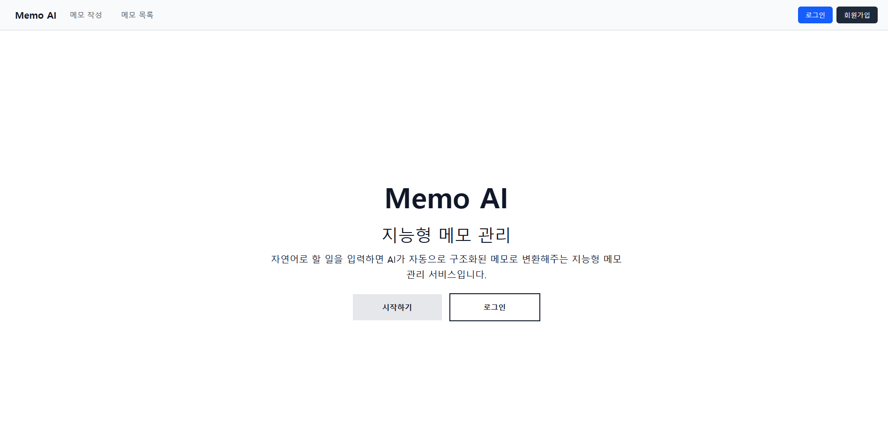
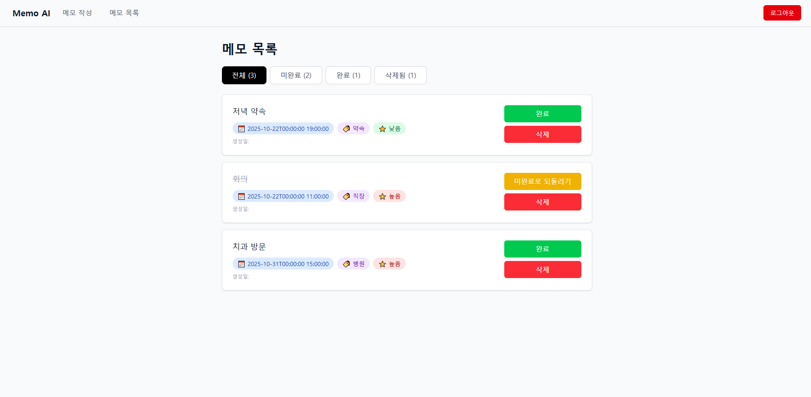

# 🤖 Memo AI App

[](https://memo-ai-app.vercel.app)
[](LICENSE)

**👉 [배포된 사이트 바로가기](https://memo-ai-app.vercel.app)**

---

## 📖 개요

**Memo AI App**은 자연어 입력만으로 할 일을 자동 분석하고 체계적인 메모를 생성해주는 AI 기반 일정 관리 애플리케이션입니다.

사용자가 "내일 오후 3시에 회의 준비"라고 입력하면, AI가 자동으로 날짜, 시간, 카테고리, 우선순위를 분석하여 메모를 생성합니다.

### 🎯 프로젝트 목적

- **생산성 향상**: 번거로운 폼 입력 없이 자연스러운 대화로 메모 생성
- **AI 활용**: Google Gemini를 활용한 자연어 처리 및 구조화된 데이터 생성
- **보안**: Supabase RLS를 통한 사용자별 데이터 격리 및 보안

---

## 🛠️ 기술 스택

### Frontend


### State Management


### Backend & Database


### AI


### Deployment


### 기술 선택 이유

| 기술              | 선택 이유                                              |
| ----------------- | ------------------------------------------------------ |
| **React 19**      | 최신 React Compiler와 성능 최적화를 활용하기 위해 선택 |
| **Redux Toolkit** | 복잡한 사용자 인증 상태와 메모 데이터 관리의 효율성    |
| **Tailwind CSS**  | 빠른 UI 개발과 반응형 디자인 구현                      |
| **Supabase**      | PostgreSQL 기반의 강력한 RLS와 간편한 인증 시스템      |
| **Google Gemini** | 구조화된 JSON 응답 생성과 한국어 자연어 처리 성능      |
| **Vite**          | 빠른 개발 서버와 HMR(Hot Module Replacement)           |

---

## ✨ 주요 기능

### 1. 🔐 회원가입 및 로그인

- Supabase Auth를 통한 안전한 이메일 인증
- JWT 기반 토큰 인증
- Redux Persist를 통한 로그인 상태 유지

### 2. 🤖 AI 기반 자동 메모 생성

```
사용자 입력: "내일 오후 3시에 팀 회의 준비하기"

AI 자동 분석 결과:
📝 내용: 팀 회의 준비하기
📅 날짜: 2025-10-22
⏰ 시간: 15:00
📂 카테고리: 직장
⭐ 우선순위: 높음
```

### 3. 📝 메모 관리

- 메모 생성, 수정, 삭제
- 완료/미완료 상태 관리
- 카테고리별 분류 (학업, 직장, 병원, 약속, 가정, 집)
- 우선순위 설정 (높음, 중간, 낮음)

### 4. 🔒 사용자별 데이터 격리

- Row Level Security(RLS)를 통한 완벽한 데이터 보안
- 각 사용자는 자신의 메모만 조회/수정/삭제 가능

### 5. 💬 실시간 AI 대화

- 자연스러운 대화형 인터페이스
- AI가 메모 생성 가능 여부를 판단하여 안내
- 저장/취소 선택 가능

---

## 🚀 프로젝트 실행 방법

### 1. 프로젝트 클론

```bash
git clone https://github.com/your-username/memo-ai-app.git
cd memo-ai-app
```

### 2. 의존성 설치

```bash
npm install
```

### 3. 환경 변수 설정

프로젝트 루트에 `.env` 파일을 생성하고 아래 내용을 입력하세요:

```env
# Google Gemini API Key
# 발급: https://aistudio.google.com/app/apikey
VITE_GEMINI_API_KEY=your_gemini_api_key_here

# Supabase Project URL
# Supabase Dashboard > Project Settings > API > Project URL
VITE_SUPABASE_URL=https://xxxxx.supabase.co

# Supabase Anonymous Key
# Supabase Dashboard > Project Settings > API > anon/public key
VITE_SUPABASE_ANON_KEY=your_supabase_anon_key_here
```

#### 환경 변수 상세 설명

| 변수명                   | 설명                         | 발급 방법                                                           |
| ------------------------ | ---------------------------- | ------------------------------------------------------------------- |
| `VITE_GEMINI_API_KEY`    | Google Gemini AI API 인증 키 | [Google AI Studio](https://aistudio.google.com/app/apikey)에서 발급 |
| `VITE_SUPABASE_URL`      | Supabase 프로젝트 URL        | Supabase 프로젝트 생성 후 API 설정에서 확인                         |
| `VITE_SUPABASE_ANON_KEY` | Supabase 익명 인증 키        | Supabase 프로젝트 API 설정에서 확인                                 |

### 4. Supabase 데이터베이스 설정

Supabase SQL Editor에서 아래 쿼리를 실행하여 테이블을 생성하세요:

```sql
-- memo 테이블 생성
CREATE TABLE memo (
  id UUID PRIMARY KEY DEFAULT uuid_generate_v4(),
  user_id UUID REFERENCES auth.users(id) NOT NULL,
  content TEXT NOT NULL,
  dueDate DATE,
  dueTime TIME,
  priority TEXT CHECK (priority IN ('높음', '중간', '낮음')),
  category TEXT CHECK (category IN ('학업', '직장', '병원', '약속', '가정', '집')),
  completed BOOLEAN DEFAULT false,
  deleted BOOLEAN DEFAULT false,
  created_at TIMESTAMP WITH TIME ZONE DEFAULT now()
);

-- RLS 활성화
ALTER TABLE memo ENABLE ROW LEVEL SECURITY;

-- RLS 정책 생성
CREATE POLICY "Enable insert for authenticated users"
ON memo FOR INSERT TO authenticated
WITH CHECK (auth.uid() = user_id);

CREATE POLICY "Enable select for users based on user_id"
ON memo FOR SELECT TO authenticated
USING (auth.uid() = user_id);

CREATE POLICY "Enable update for users based on user_id"
ON memo FOR UPDATE TO authenticated
USING (auth.uid() = user_id);

CREATE POLICY "Enable delete for users based on user_id"
ON memo FOR DELETE TO authenticated
USING (auth.uid() = user_id);
```

### 5. 개발 서버 실행

```bash
npm run dev
```

브라우저에서 `http://localhost:5173` 접속

### 6. 빌드

```bash
npm run build
```

---

## 📂 프로젝트 구조

```
memo-ai-app/
├── src/
│   ├── components/         # 재사용 가능한 컴포넌트
│   │   ├── ChatForm.jsx
│   │   ├── ChatMessage.jsx
│   │   ├── MessageList.jsx
│   │   └── NavigationBar.jsx
│   ├── Page/              # 페이지 컴포넌트
│   │   ├── AuthPages/
│   │   │   ├── Login.jsx
│   │   │   └── SignUp.jsx
│   │   └── RootPages/
│   │       ├── Home.jsx
│   │       ├── MemoCreate.jsx
│   │       └── MemoList.jsx
│   ├── layout/            # 레이아웃 컴포넌트
│   │   ├── AuthLayout.jsx
│   │   └── RootLayout.jsx
│   ├── router/            # 라우터 설정
│   │   └── routes/
│   ├── store/             # Redux 상태 관리
│   │   ├── authSlice.js
│   │   ├── memoSlice.js
│   │   └── index.js
│   ├── services/          # API 서비스
│   │   ├── api.js
│   │   └── memoService.js
│   ├── utils/             # 유틸리티
│   │   └── genai.js       # Gemini AI 설정
│   └── constants/         # 상수
│       └── paths.js
├── public/
├── .env                   # 환경 변수 (gitignore)
├── package.json
└── vite.config.js
```

---

## 📊 성과 및 학습 내용

### ✅ 주요 성과

- ✨ **AI 통합**: Google Gemini API를 활용한 자연어 처리 및 구조화된 데이터 생성
- 🔒 **보안 구현**: Supabase RLS를 통한 완벽한 사용자 데이터 격리
- 🎨 **UX 개선**: 대화형 인터페이스로 직관적인 사용자 경험 제공
- 🚀 **배포**: Vercel을 통한 CI/CD 파이프라인 구축

### 📚 새롭게 학습한 내용

1. **Google Gemini API**

   - JSON Schema 기반 구조화된 응답 생성
   - System Instruction을 통한 AI 행동 제어
   - 한국어 자연어 처리 및 최적화

2. **Supabase RLS (Row Level Security)**

   - PostgreSQL의 RLS 정책 설계 및 구현
   - JWT 토큰 기반 인증과 RLS 통합
   - `auth.uid()`를 활용한 사용자별 데이터 격리

3. **Redux Persist**

   - 로그인 상태 유지 구현
   - Storage 전략 및 최적화

4. **React 19 최신 기능**
   - 최신 React 생태계 적용
   - 성능 최적화 기법

---

## 🔧 아쉬운 점 및 개선 사항

### 아쉬운 점

- ⏰ 실시간 알림 기능 미구현
- 🔍 검색 기능 부재
- 📰 개인 프로필 페이지 미구현

### 향후 계획

- [ ] 메모 검색 및 필터링 기능 추가
- [ ] 개인 프로필 / 개인 정보 페이지 추가
- [ ] 캘린더 뷰 제공
- [ ] 메모 공유 기능
- [ ] 반복 일정 설정 기능

---

## 📸 스크린샷





---

## 🤝 기여

이슈와 풀 리퀘스트는 언제나 환영합니다!

1. Fork the Project
2. Create your Feature Branch (`git checkout -b feature/AmazingFeature`)
3. Commit your Changes (`git commit -m 'Add some AmazingFeature'`)
4. Push to the Branch (`git push origin feature/AmazingFeature`)
5. Open a Pull Request

---

## 📧 연락처

**E-Mail**: jsu99053@gmail.com

**Linked-In**:

**Github**:  https://github.com/stanstanstanlee

**Project Link**: [https://github.com/stanstanstanlee/memo-ai-app](https://github.com/stanstanstanlee/memo-ai-app)

**Deployed Site**: [https://memo-ai-app.vercel.app](https://memo-ai-app.vercel.app)

---

<div align="center">

[](https://github.com/stanstanstanlee/memo-ai-app)
[](https://github.com/stanstanstanlee/memo-ai-app)

</div>
